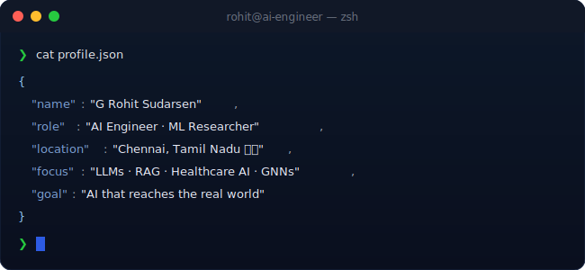

<!-- 
╔══════════════════════════════════════════════════════════════════════════════╗
║                                                                              ║
║   ██████╗  ██████╗ ██╗  ██╗██╗████████╗    ███████╗                        ║
║   ██╔══██╗██╔═══██╗██║  ██║██║╚══██╔══╝    ██╔════╝                        ║
║   ██████╔╝██║   ██║███████║██║   ██║       ███████╗                        ║
║   ██╔══██╗██║   ██║██╔══██║██║   ██║       ╚════██║                        ║
║   ██║  ██║╚██████╔╝██║  ██║██║   ██║       ███████║                        ║
║   ╚═╝  ╚═╝ ╚═════╝ ╚═╝  ╚═╝╚═╝   ╚═╝       ╚══════╝                        ║
║                                                                              ║
║              🚀 AI ENGINEER  •  ML RESEARCHER  •  HEALTHCARE AI 🚀          ║
║                                                                              ║
╚══════════════════════════════════════════════════════════════════════════════╝
-->

<div align="center">

  <!-- 🎯 ANIMATED HEADER -->
  

  <br/>

  <!-- 📊 PROFILE BADGES -->
  <a href="https://github.com/Grohit22013">
    
  </a>
  &nbsp;
  <a href="https://github.com/Grohit22013?tab=repositories">
    
  </a>
  &nbsp;
  <a href="https://github.com/Grohit22013?tab=followers">
    
  </a>
  &nbsp;
  <a href="https://github.com/Grohit22013">
    
  </a>

</div>

<br/>

<!-- 🖥️ TERMINAL INTRO SECTION -->
<div align="center">
  
</div>

<br/>


<br/>

<!-- 👤 ABOUT ME SECTION -->


<br/><br/>

<table>
<tr>
<td width="55%" valign="top">

### 🎯 What I Do

```yaml
name: G Rohit Sudarsen
located_in: Chennai, Tamil Nadu 🇮🇳
degree: B.Tech · AI & Data Science · CGPA 8.90
college: R.M.K Engineering College
honours: Intelligent Healthcare Specialization

areas_of_expertise:
  - 🤖 LLMs & Generative AI
  - 🏥 Healthcare AI Systems
  - 🧠 Deep Learning & GNNs
  - 📊 MLOps & Model Deployment
  - 🔍 RAG Pipelines & AI Agents

currently_building:
  - RAG-based AI Physics Tutor (IIM Winner)
  - Multi-modal Neonatal HIE Detector
  - Medicare Fraud Detection via GNN

philosophy: "Intelligence is only useful when it reaches the real world."
```

</td>
<td width="45%" valign="top">

### 🚀 Current Focus

- 🔬 **Researching** multi-modal medical AI
- 🤖 **Building** LLM-powered RAG systems
- 🧠 **Exploring** GNNs & hybrid models
- 🌟 **Competing** at national hackathons
- 📚 **Specializing** in Healthcare AI
- 🏆 **Winning** at IIM, BITS, ISTE events

<br/>

### 💡 Quick Facts

- 🎓 CBSE Top 0.01% · Centum in Maths
- 🔥 Passionate about AI for social good
- 🌱 Always shipping real-world systems
- ☕ Fueled by curiosity & problem-solving

</td>
</tr>
</table>

<br/>


<br/>

<!-- 🏆 ACHIEVEMENTS SECTION -->


<br/><br/>

<div align="center">
  <a href="https://github.com/ryo-ma/github-profile-trophy">
    
  </a>
</div>

<br/>


<br/>

<!-- 📊 GITHUB ANALYTICS -->


<br/><br/>

<div align="center">

  <!-- GitHub Stats + Streak in ONE ROW -->
  <a href="https://github.com/Grohit22013">
    
  </a>
  &nbsp;
  <a href="https://github.com/Grohit22013">
    
  </a>

  <br/><br/>

  <!-- Top Languages -->
  <a href="https://github.com/Grohit22013">
    
  </a>

  <br/><br/>

  <!-- Activity Graph -->
  <a href="https://github.com/Grohit22013">
    
  </a>

  <br/><br/>

  <!-- Profile Summary -->
  

</div>

<br/>


<br/>

<!-- 🎮 CONTRIBUTION SHOWCASE -->


<br/><br/>

<div align="center">

  <picture>
    <source media="(prefers-color-scheme: dark)" srcset="./assets/pacman-contribution-graph-dark.svg"/>
    <source media="(prefers-color-scheme: light)" srcset="./assets/pacman-contribution-graph.svg"/>
    
  </picture>

  <br/>
  <sub>👾 Watch Pac-Man devour my contributions!</sub>

</div>

<br/>


<br/>

<!-- ⚡ TECH STACK -->


<br/><br/>

<div align="center">

<!-- 🤖 AI & MACHINE LEARNING -->
<h4>🤖 AI & Machine Learning</h4>
<p>
  <a href="https://www.python.org/" target="_blank"></a>
  <a href="https://www.tensorflow.org/" target="_blank"></a>
  <a href="https://pytorch.org/" target="_blank"></a>
  <a href="https://scikit-learn.org/" target="_blank"></a>
  <a href="https://opencv.org/" target="_blank"></a>
</p>

<!-- 🚀 MLOps & DEPLOYMENT -->
<h4>🚀 MLOps & Deployment</h4>
<p>
  <a href="https://www.docker.com/" target="_blank"></a>
  <a href="https://fastapi.tiangolo.com/" target="_blank"></a>
  <a href="https://flask.palletsprojects.com/" target="_blank"></a>
  <a href="https://aws.amazon.com/" target="_blank"></a>
  <a href="https://github.com/features/actions" target="_blank"></a>
</p>

<!-- 🗄️ DATABASES -->
<h4>🗄️ Databases</h4>
<p>
  <a href="https://www.postgresql.org/" target="_blank"></a>
  <a href="https://www.mysql.com/" target="_blank"></a>
  <a href="https://www.sqlite.org/" target="_blank"></a>
  <a href="https://www.mongodb.com/" target="_blank"></a>
</p>

<!-- 🔧 TOOLS & PLATFORMS -->
<h4>🔧 Tools & Platforms</h4>
<p>
  <a href="https://git-scm.com/" target="_blank"></a>
  <a href="https://www.linux.org/" target="_blank"></a>
  <a href="https://code.visualstudio.com/" target="_blank"></a>
  <a href="https://jupyter.org/" target="_blank"></a>
  <a href="https://www.postman.com/" target="_blank"></a>
  <a href="https://www.figma.com/" target="_blank"></a>
</p>

</div>

<br/>


<br/>

<!-- 🔥 CURRENTLY BUILDING -->
<div align="center">

### ⚡ Currently Building & Learning

<br/>

<a href="https://github.com/Grohit22013">
  
</a>
&nbsp;
<a href="https://github.com/Grohit22013">
  
</a>
&nbsp;
<a href="https://github.com/Grohit22013">
  
</a>

</div>

<br/>


<br/>

<!-- 🌐 CONNECT WITH ME -->


<br/><br/>

<div align="center">

<a href="https://github.com/Grohit22013" target="_blank">
  
</a>
&nbsp;
<a href="https://www.linkedin.com/in/g-rohit-sudarsen" target="_blank">
  
</a>
&nbsp;
<a href="mailto:sudarsenrohit@gmail.com">
  
</a>
&nbsp;
<a href="https://leetcode.com/u/MonkeyDLuffy28/" target="_blank">
  
</a>

</div>

<br/>


<br/>

<!-- 💭 RANDOM DEV QUOTE -->
<div align="center">

### 💭 Random Dev Quote

<br/>

<a href="https://github.com/Grohit22013">
  
</a>

</div>

<br/>

<!-- 🌟 FOOTER -->
<div align="center">

  

  <br/><br/>

  

</div>

<!-- 📝 END OF README -->
